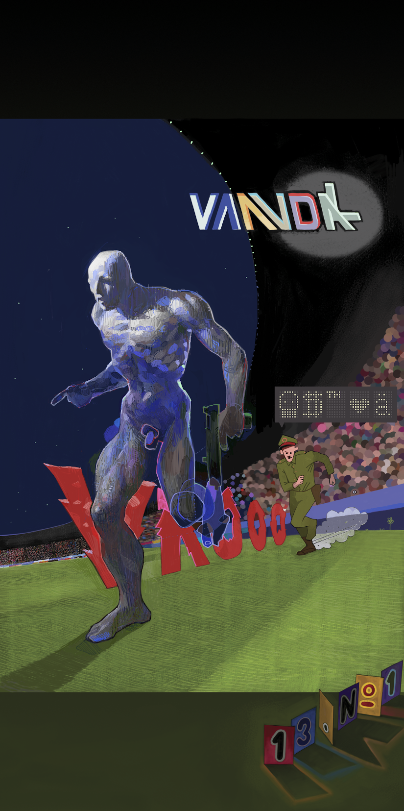

## Prin4ing
**T**here is a lot of *Documentation* here .. The problem text is
in the source *printing.py*, but if you want to check it,
[clck](https://ioinformatics.org/files/ioi1995problem3.pdf).
It's about a *LAN* network consisting of computer clients
which share a common printing server through a semaphore.

[Africa](https://youtu.be/FTQbiNvZqaY)
